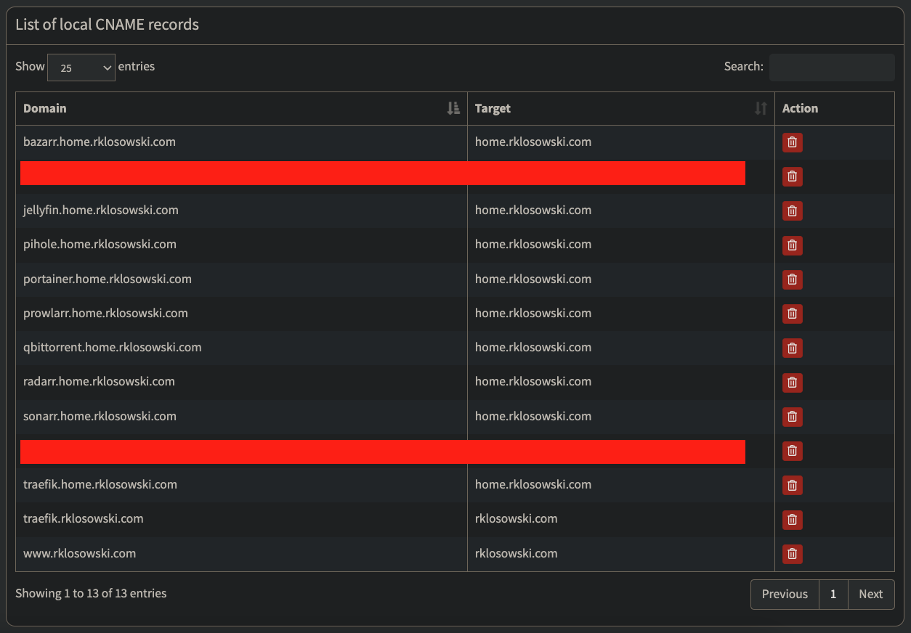

## 💚 Homelab with Ansible

This project provides a collection of Ansible playbooks to set up a Proxmox homelab. The playbooks allow you to configure various servers, including a network server, home server, media server, and personal website server. You can choose which servers to set up by running the playbooks individually.

I use this project to set up my homelab with Proxmox and LXD containers. The playbooks are designed to be modular, so you can easily add new servers or services. If this project doesn't have a service you need, you can create your own playbook or at least use the existing playbooks as a reference. I hope this project helps you set up your homelab and learn more about Ansible and some Infra as Code (IaC) practices.

More servers and services will be added in the future. Stay tuned! 🚀

Also, feel free to contribute to this project by creating new playbooks or improving the existing ones. I would love to see your ideas and suggestions. 🙌🏻

---

### Features

Choose from the following servers to set up:

- Network server

  - DDNS setup with Cloudflare
  - Pi-hole DNS

- Media server

  - Samba file server
  - Jellyfin
  - Qbittorrent
  - Sonarr
  - Radarr
  - Bazarr
  - Flaresolverr
  - Prowlarr

- Home server

  - Dashy dashboard
  - Portainer
  - Traefik reverse proxy
  - Traefik + Cloudflare DNS challenge
  - DNS resolution from home to network and media servers (see notes below)

- My personal website server (optional)
  - Dockerized Next.js template
  - Traefik reverse proxy
  - Traefik + Cloudflare DNS challenge
  - Ghost CMS for blog posts

---

### Setup

Follow these steps to set up your homelab servers with Ansible:

1. Install ansible and ansible-galaxy on your local machine.

2. Install direnv. This tool will allow you to set the environment variables for the Ansible playbooks in the `.envrc` file.

3. Create a `.envrc` file in the root of the project based on the `.envrc.example` file. The `.envrc` file will be used to set the environment variables for the Ansible playbooks.
   Keep reading to see how to set up the your own environment variables.

4. Run the following command to allow the `.envrc` file:

```bash
direnv allow .
```

5. Set the path to the Ansible directory:

```bash
cd ansible
```

#### Running the Ansible Playbooks

I recomment you to create your servers as LXD containers in Proxmox. Remember to set up the IP address in the environment variables file. Also make sure you have the ssh keys ready for connecting with Ansible.

To check the connection with one of your servers, use the following command:

```bash
ansible network-server -m ping -i inventory.yml
```

##### 1. Set up the `network server`

Create your proxmox network LXD ununtu container and make sure you have the IP address and ssh keys ready for connecting with Ansible.

Make sure you have a domain set up with Cloudflare. You will need the domain name, the API key, and the email address associated with the Cloudflare account.

Update your environment variables in the `.envrc` file with the correct values.

Everytime you change the `.envrc` file, you need to run `direnv allow .` to apply the changes.

To set up the network server, run the following command:

```bash
ansible-playbook playbooks/servers/network_server/main.yml -i inventory.yml -K
```

This will set up the network server with the following services:

- DDNS setup with Cloudflare

  This service will create a cron job that will update the Cloudflare DNS record with the current public IP address of the network server.
  This can be useful if you have a dynamic IP address and want to access your services from outside your network.
  Your ddns entry will be `http://<your_ddns_subdomain>.<your_domain>.com`.
  

- Pi-hole

  This service will set up a Pi-hole server that will block ads and trackers on your network.
  You can also use it as your DNS server.
  To access the Pi-hole admin panel, go to `http://<network_server_ip>/admin`.
  You can also set up your router to use the Pi-hole as the DNS server.

##### 2. Set up the `media server`

Create your proxmox network LXD ununtu container and make sure you have the IP address and ssh keys ready for connecting with Ansible.

To set up the media server, run the following command:

```bash
ansible-playbook playbooks/servers/media_server/main.yml -i inventory.yml -K
```

This will set up the media server with the following services:

- Samba file server
- Jellyfin
- Qbittorrent
- Sonarr
- Radarr
- Bazarr
- Flaresolverr
- Prowlarr

##### 3. Set up the `home server`

Create your proxmox network LXD ununtu container and make sure you have the IP address and ssh keys ready for connecting with Ansible.

Important: If you want your home server traefik reverse proxy to be aware of your network services and media server, you need to run the media server and network server playbooks first.

If their environment variables are not set, the traefik reverse proxy will not be able to route the requests to the correct services and will ignore them.

We use home as the dns entrypoint (traefik reverse proxy) for most of the other services dns, like:

```
https://home.<your_domain>.com
https://pihole.home.<your_domain>.com
https://portainer.home.<your_domain>.com
https://jellyfin.home.<your_domain>.com
https://qbittorrent.home.<your_domain>.com
and so on...
```

Make sure you have the dns records set up in pi-hole. They should look to something like this (replace with your domain and with your container IP address):




To set up your home server, run the following command:

```bash
ansible-playbook playbooks/servers/home_server/main.yml -i inventory.yml -K
```

You can access the home server dashboard at `https://home.<your_domain>.com`.

There you can customize your dashboard with the Dashy dashboard. You can also access the Portainer dashboard at `https://portainer.home.<your_domain>.com`.

Example of my home server dashboard:


Traefik should be able to route the requests to the correct services based on the subdomain. You can also set up the Traefik dashboard at `https://traefik.home.<your_domain>.com`.
Traefik will also set up the Cloudflare DNS challenge to automatically update the DNS records for the subdomains.

##### 4. Set up a personal website server (optional)

This is a template for a personal website server using Next.js. You can replace the template with your own Next.js project.

In this example I host my own personal website at [https://rklosowski.com](https://rklosowski.com).

You can also check the website repository [https://github.com/klosowsk/rklosowski](here).

To set up the personal website server, run the following command:

```bash
ansible-playbook playbooks/servers/rklosowski_server/main.yml -i inventory.yml -K
```

### Thanks!! ✋🏻

I hope you enjoy this project and find it useful for setting up your homelab. If you have any questions or suggestions, feel free to reach out to me. I would love to hear from you! 🚀
